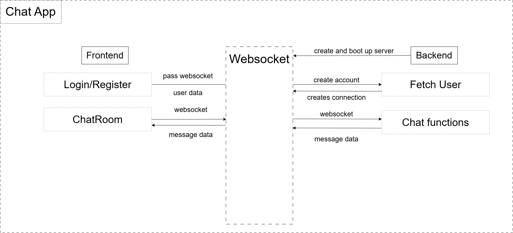

# small-chat-app
Beta version of a small chat application using FastAPI Python and Next.js

## Description

The app has for a goal to serve as a beta version for the full-scale app for an application similar to Discord.
The backend will be in FastAPI utilizing `websockets`. For the frontend Next.js will be utilized for simple design.

## Backend

The backend will have a very simple architecture: 
 - WebSockets: connection for the messaging functionality
 - REST API:
  - creating users - simple email which is added to a dictionary where the email is a key for value of websocket.
  - creating groups - simple name which works also as an identifier of the grouo and list of members and messages.
- When WS receieves/sends message, the message gets stored in the group.messages list.

## Frontend

The frontend will have a very simple architecture:
 - Register/Login page: user provides email and is then redirected to the chat app.
 - Chatting page: rooms for converstaion + creating personal groupchat.

## Architecture

